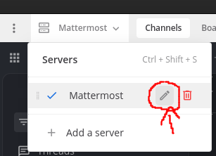

## Mattermost Chat Exporter

Exports all Mattermost posts and attachments accessible to a user. This exists because I did not find any other way to get to this data outside of paid versions or addons for Mattermost, so I just wrote it myself. This is version 1 because I needed the functionality fast so the code is still very rough and only follows a happy path with rudimentary error handling and a lot of duplication. 

### Functionality

This script will use the Mattermost rest api v4 to
- Log-in as your user
- Export all users available in your instance
- Export all custom emojis available in your instance
- Export all teams you are part-in
  * Export all channels within a team
    * Export all posts within a channel
    * Export all attachments shared within a channel

#### Format

The exported data will be written to a directory you choose with the following structure

```text
- Mattermost-Export-YYYY-mm-dd_HH-MM-SS
  * emojis
    - images
    - emojis.json
  * teams
    - <folder per team id>
      * <folder per channel id>
        - attachments
        - thumbnails
        - members.json
        - pinned-posts.json
        - posts-page-<page number>.json
      * channels.json
    - teams.json
  * users
    - profile-pictures
    - me.json
    - users.json
```

### Compatability

The exporter is compatible with the Mattermost api v4.

### Install and Use

All you need is Python 3. I developed and tested it locally with Python 3.12

#### Install

- Clone this repository
- Make sure you have Python installed and available through the `python` command
- Open a terminal and enter the `/src` folder of this repository
- Execute the script with `python export.py -h`. A usage message will be displayed

#### Use

##### Authentication

The script needs to authenticate you against your Mattermost instance. It can do this either using your user/password authentication or through a `token`. 

###### User/Password

If no authentication info is required the script will ask for your user and password. You can also provide it as arguments by using

```
python export.py -u <your login user> -p <your login password> <your-mattermost-url>
```

When logging in through user/password the script will output your session token that you can then user for further export calls against your mattermost instance. You can prevent that by adding `--hide-token` to the scripts arguments.

###### Token

On a user/password login the script will print your session `token` to the output console. You can use this token for further export runs by providing it using `-t` or `--token`. No further user/password info is required then, the script automatically infer your user based on the logged in session. 

```
python export.py -t <your token> <your-mattermost-url>
```

Alternatively you can also provide a `Personal Access Token` in the same way that you can generate through the [Mattermost client UI](https://developers.mattermost.com/integrate/reference/personal-access-token/).

##### Export path

The script requires a writeable export path set through the `-o` or `--output` option. It will create its own subfolder with the name `Mattermost-Export-YYYY-mm-dd_HH-MM-SS` within that path that will contain all exported data.

##### url

The `url` argument must be the last argument of the script call and is required. The url points to your Mattermost server that you want to export the data from. Example: `https://localhost:8065/`. You can find the server url within your Mattermost desktop client under:



The `url` required is displayed within the field `Server URL`.